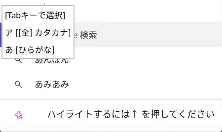
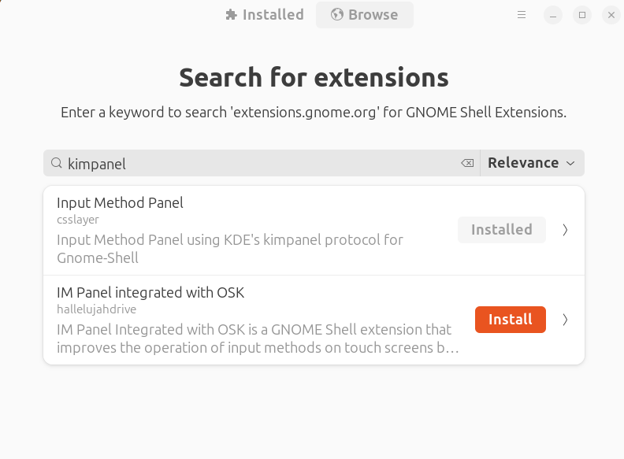
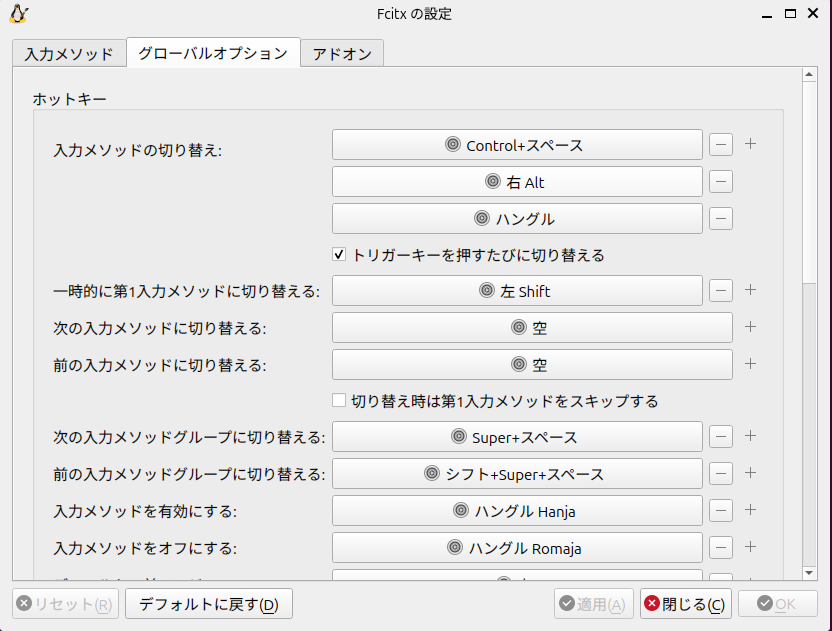
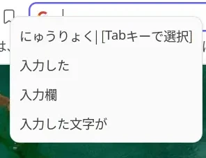

## ここに書くこと

- fcitx5パッケージのインストール方法
- Input Method Extension(kimpanel)の導入(手動)
- fcitx5で独自に設定した項目の補足(Altでfcitx5切り替え、「アプリケーションにプリエディットを表示する」のoff)

## fcitx5で日本語入力を設定

以下のとおりにfcitx5を導入した

金子邦彦研究室 「Ubuntu で日本語インプット・メソッド (Fcitx5 + Mozc) を設定する」 https://www.kkaneko.jp/tools/server/gnome_ja_input_method.html

1. パッケージをインストール
```bash
sudo apt update
sudo apt -y install language-selector-common
sudo apt -y install $(check-language-support)

sudo apt update
sudo apt -y install fcitx5 fcitx5-mozc fcitx5-configtool

im-config -n fcitx5
```

2. 再起動して設定を反映
```bash
sudo shutdown -r now
```

3. ログイン後に`ctrl + space`でfctix5の日本語入力に切り替われば成功

## Input Method Extension(kimpanel)の導入(手動)

### Input Method Extension(kimpanel)導入後の見た目の比較

#### Before
何も設定しない状態のポップアップ


#### After
一方のInput Method Extension(kimpanel)を導入したあとのポップアップ


### Input Method Panel(kimpanel)のインストールと有効化

ポップアップの見た目を調整するために、Input Method Extension(kimpanel)の拡張機能を導入する。
以下より、GNOME Shell integrationのChrome拡張機能を入れる。
[GNOME Shell integration - Chrome ウェブストア](https://chromewebstore.google.com/detail/gnome-shell-integration/gphhapmejobijbbhgpjhcjognlahblep)

次に、gnome-browser-connectorをaptでインストールする。
参考: [GNOME browser integration - Installation guide](https://gnome.pages.gitlab.gnome.org/gnome-browser-integration/pages/installation-guide.html#ubuntu_linux)
```bash
sudo apt install gnome-browser-connector
```


Shellの方でもextension-managerを使ってInput Method Panelを導入する。
```bash
extension-manager
```

ポップアップが開くので、そこからBrowseを押す。
その後、検索窓にkimpanelを入力し、Input Method Panelをインストールする。


Input Method Panelをトグルボタンで有効化する。


その後、再起動して設定を反映する。
前述のようなポップアップの見た目になっていれば終了である。

## fcitx5の設定

`~/.config/fcitx5`を参照すればよいが、いくつか補足する
### ctrl+spaceを右altに設定

以下のようにAlt_Rを日本語と英語入力の切り替えキーとして使用する。
```bash ~/.config/fcitx/config
[Hotkey/TriggerKeys]
0=Control+space
1=Alt+Alt_R
2=Hangul
```

GUIで設定する場合は以下のように「入力メソッドの切り替え」から「右 Alt」を追加する


### 「アプリケーションにプリエディットを表示する」をoffに設定

ブラウザを使っているときだけ、入力と入力補助のポップアップがかぶってしまって非常に見づらい。


ポップアップの位置変更は難しかったため、一旦の解決策として、「アプリケーションにプリエディットを表示する」をoffに設定する。この設定により、入力中の文字がポップアップの一番上に表示されるようになる。




`~/.config/fcitx5/config`で設定する場合は以下をFalseに変更する。
```bash ~/.config/fcitx5
[Behavior]
# アプリケーションにプリエディットを表示する
PreeditEnabledByDefault=False
```

GUIで設定する場合は「入力状態を共有する > アプリケーションにプリエディットを表示する」のチェックを外す。


